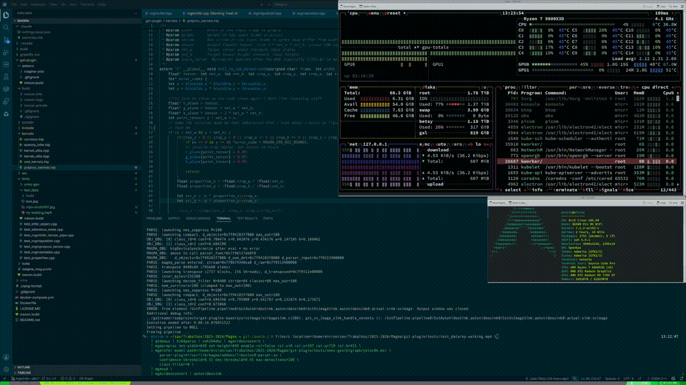

# Rocm's Magma!
Tired of watching proprietary nvidia scooping up the computer vision scene, with proprietary frameworks like DeepStream? Watch as the rocm melts into streaming molten magma!
To put it bluntly the idea is not doing **the whole compatibility and flexibility over performance**, the reason is: 
If nvidia won't play ball so whats the point of making a software more complex, if the bigger fish reaps the rewards of deep optimization?

## INB4's
Q: Well is this a dead project/wheres results?
A: Im known to easily distract myself but heres a proof that it does... well something!
Its working in a 7800xt(neofetch misread it due to pcie identifiers), its a bit choppy since the gpu is already being hamered by a bunch of apps(obs, vscode) and i wasnt responsible with mgmosd and mgmtensordump(i mostly vibe coded them to speed up development):


## AI Usage

Permited as long as it doesnt become mindless pushing and you are using it as an actual tool(ie you are actually thinking and trying to upkeep code). However **ignore** all file artifacts relating to agents, AI-related markdowns, etc... 
Ie some vibecoding is allowed but only to speed up some development ie core stuff should be reread by hand

## License

This code is provided under a LGPLv3 license check LICENSE.md

## See it in action!
### Docker
Theres not much to say, its just an example to ease developing over the libraries, theres a docker-compose file to pull the full playtest environment.

### assuming you already have the environment setup
**I know it seems like a lot** but 1/2 of the commands are just getting the onnx(i tested with some other models but for some reason no results and im too lazy to debug when from ultralytics it works).

```sh
#fetch the model:
curl -L -o /tmp/yolov8n.pt "https://github.com/ultralytics/assets/releases/download/v8.4.0/yolov8n.pt" 
python -c "import shutil, os; os.makedirs('./gst-plugin/tests/onnx-gen/onnx-models', exist_ok=True); shutil.move('/tmp/yolov8n.onnx', './gst-plugin/tests/onnx-gen/onnx-models/yolov8n.onnx')"
#compile the onnx into a mxr(straight to onnx is also possible but pathwise its annoying regardless of how it would be implemented so... its more convenient to just organise it to your liking)
migraphx-driver compile --onnx ./gst-plugin/tests/onnx-gen/onnx-models/yolov8n.onnx --binary --output ./gst-plugin/tests/onnx-gen/migraph/yolov8n.mxr
#watch the magic happen on rocm's environment
gst-launch-1.0 filesrc location=./gst-plugin/tests/test_data/ny-walking.mp4 ! qtdemux ! h264parse ! vah264dec ! mgmvideoconvert \
  ! mgmpreproc net-width=640 net-height=640 enable-roi=false roi-x=0 roi-y=587 roi-w=719 roi-h=451 \
  ! mgminfer model-path=./gst-plugin/tests/onnx-gen/migraph/yolov8n.mxr \
      parser-plugin=/usr/lib/magma/addons/libyolov8-parser.so \
      confidence-threshold=0.51 nms-threshold=0.45 max-detections=100 \
      class-filter=0 \
  ! mgmosd \
  ! mgmvideoconvert ! autovideosink

```

### how do i compile the god damn thing:
I do it like so for since im on arch and /usr/local is a mess
```sh
rm -rf build && \                                                                                                                                                                                  14:32:30
meson setup build --prefix=/usr --buildtype=release && \
meson compile -C build && \
sudo meson install -C build
```
